# Smart Football Hub — Entity Relationship Diagram

This ERD models all platform features: authentication, personalized dashboards,
real-time stats, news, squads, matches, standings, the match simulator, the
dream-team lineup builder, notifications, multi-language support, and the AI
bonus features (predictions, chatbot, transfer advisor).

> Tip: paste the block below into <https://mermaid.live> or any Markdown viewer
> with Mermaid support to render it visually.

```mermaid
erDiagram
    USER ||--o| USER_PREFERENCE       : has
    USER ||--o{ USER_FAVORITE_TEAM     : selects
    USER ||--o{ LINEUP                 : builds
    USER ||--o{ SIMULATION             : runs
    USER ||--o{ NOTIFICATION           : receives
    USER ||--o{ CHAT_SESSION           : opens
    USER ||--o{ LINEUP_SHARE           : shares

    TEAM ||--o{ USER_FAVORITE_TEAM     : "favorited by"
    TEAM ||--o{ PLAYER                 : rosters
    TEAM ||--o{ TEAM_STATISTIC         : tracked_by
    TEAM ||--o{ NEWS_ARTICLE           : "tagged in"
    TEAM ||--o{ STANDING               : "ranked in"
    TEAM ||--o{ LINEUP                 : "built from"
    TEAM ||--o{ TRANSFER_SUGGESTION    : "advised for"

    COMPETITION ||--o{ SEASON          : has
    SEASON ||--o{ STANDING             : produces
    SEASON ||--o{ MATCH                : schedules
    SEASON ||--o{ COMPETITION_TEAM     : includes
    TEAM ||--o{ COMPETITION_TEAM       : "participates in"

    MATCH ||--o{ MATCH_EVENT           : contains
    MATCH ||--o| MATCH_PREDICTION      : "predicted by AI"
    MATCH ||--o{ SIMULATION            : "simulated in"
    TEAM ||--o{ MATCH                  : "home/away"

    PLAYER ||--o{ PLAYER_STATISTIC     : measured_by
    PLAYER ||--o{ MATCH_EVENT          : "involved in"
    PLAYER ||--o{ LINEUP_PLAYER        : "placed as"
    PLAYER ||--o{ TRANSFER_SUGGESTION  : "suggested as"

    FORMATION ||--o{ LINEUP            : uses
    FORMATION ||--o{ FORMATION_SLOT    : defines
    LINEUP ||--o{ LINEUP_PLAYER        : "made of"
    FORMATION_SLOT ||--o{ LINEUP_PLAYER: fills
    LINEUP ||--o{ LINEUP_SHARE         : "shared via"

    CHAT_SESSION ||--o{ CHAT_MESSAGE   : holds

    LANGUAGE ||--o{ USER_PREFERENCE    : "set as"
    LANGUAGE ||--o{ TRANSLATION        : localizes

    USER {
        uuid     id PK
        string   email UK
        string   username UK
        string   password_hash
        string   display_name
        string   avatar_url
        boolean  email_verified
        datetime created_at
        datetime last_login_at
    }

    USER_PREFERENCE {
        uuid     id PK
        uuid     user_id FK
        string   theme "light | dark | system"
        uuid     language_id FK
        boolean  notify_matches
        boolean  notify_team_news
        json     dashboard_layout
        datetime updated_at
    }

    USER_FAVORITE_TEAM {
        uuid     id PK
        uuid     user_id FK
        uuid     team_id FK
        boolean  is_primary
        datetime created_at
    }

    TEAM {
        uuid     id PK
        string   external_api_id UK "id from sports API"
        string   name
        string   short_name
        string   country
        string   crest_url
        string   stadium
        int      founded_year
    }

    PLAYER {
        uuid     id PK
        string   external_api_id UK
        uuid     team_id FK
        string   full_name
        string   position "GK | DEF | MID | FWD"
        int      shirt_number
        string   nationality
        date     date_of_birth
        decimal  market_value "Transfermarkt-style"
        string   photo_url
    }

    COMPETITION {
        uuid     id PK
        string   external_api_id UK
        string   name "league or cup"
        string   country
        string   type "league | cup"
        string   logo_url
    }

    SEASON {
        uuid     id PK
        uuid     competition_id FK
        string   label "e.g. 2025/26"
        date     start_date
        date     end_date
        boolean  is_current
    }

    COMPETITION_TEAM {
        uuid     id PK
        uuid     season_id FK
        uuid     team_id FK
    }

    STANDING {
        uuid     id PK
        uuid     season_id FK
        uuid     team_id FK
        int      position
        int      played
        int      won
        int      drawn
        int      lost
        int      goals_for
        int      goals_against
        int      points
        boolean  is_simulated "true if from simulator"
        datetime updated_at
    }

    MATCH {
        uuid     id PK
        string   external_api_id UK
        uuid     season_id FK
        uuid     home_team_id FK
        uuid     away_team_id FK
        datetime kickoff_at
        string   status "scheduled | live | finished"
        int      home_score
        int      away_score
        string   venue
        int      matchday
    }

    MATCH_EVENT {
        uuid     id PK
        uuid     match_id FK
        uuid     player_id FK
        string   type "goal | assist | yellow | red | sub"
        int      minute
        string   detail
    }

    TEAM_STATISTIC {
        uuid     id PK
        uuid     team_id FK
        uuid     season_id FK
        decimal  avg_possession
        decimal  goals_per_game
        int      clean_sheets
        decimal  win_rate
        json     form "last 5 results"
        datetime updated_at
    }

    PLAYER_STATISTIC {
        uuid     id PK
        uuid     player_id FK
        uuid     season_id FK
        int      appearances
        int      goals
        int      assists
        int      minutes_played
        decimal  rating
    }

    NEWS_ARTICLE {
        uuid     id PK
        string   source
        string   external_url UK
        uuid     team_id FK
        string   title
        text     summary
        string   image_url
        datetime published_at
        datetime fetched_at
    }

    FORMATION {
        uuid     id PK
        string   name "4-3-3 | 4-4-2 | 3-5-2"
        json     layout "slot coordinates"
    }

    FORMATION_SLOT {
        uuid     id PK
        uuid     formation_id FK
        string   role "GK | LB | CM | ST ..."
        decimal  pos_x
        decimal  pos_y
    }

    LINEUP {
        uuid     id PK
        uuid     user_id FK
        uuid     team_id FK
        uuid     formation_id FK
        string   name "Dream Team name"
        boolean  is_public
        datetime created_at
        datetime updated_at
    }

    LINEUP_PLAYER {
        uuid     id PK
        uuid     lineup_id FK
        uuid     player_id FK
        uuid     formation_slot_id FK
        boolean  is_captain
    }

    LINEUP_SHARE {
        uuid     id PK
        uuid     lineup_id FK
        uuid     user_id FK "owner"
        string   share_token UK
        datetime expires_at
        datetime created_at
    }

    SIMULATION {
        uuid     id PK
        uuid     user_id FK
        uuid     match_id FK
        int      simulated_home_score
        int      simulated_away_score
        json     resulting_standings
        datetime created_at
    }

    NOTIFICATION {
        uuid     id PK
        uuid     user_id FK
        string   type "match | news | result"
        string   title
        text     body
        boolean  is_read
        datetime created_at
    }

    MATCH_PREDICTION {
        uuid     id PK
        uuid     match_id FK
        decimal  home_win_prob
        decimal  draw_prob
        decimal  away_win_prob
        string   model_version
        json     reasoning
        datetime generated_at
    }

    TRANSFER_SUGGESTION {
        uuid     id PK
        uuid     team_id FK
        uuid     player_id FK "suggested player"
        string   weak_position
        text     rationale
        decimal  fit_score
        string   data_source "e.g. Transfermarkt"
        datetime generated_at
    }

    CHAT_SESSION {
        uuid     id PK
        uuid     user_id FK
        string   title
        datetime created_at
    }

    CHAT_MESSAGE {
        uuid     id PK
        uuid     chat_session_id FK
        string   role "user | assistant"
        text     content
        json     context_used "stats/matches referenced"
        datetime created_at
    }

    LANGUAGE {
        uuid     id PK
        string   code UK "en | pt | es"
        string   name
        boolean  is_active
    }

    TRANSLATION {
        uuid     id PK
        uuid     language_id FK
        string   namespace
        string   key
        text     value
    }
```

## How the features map to entities

| Feature | Entities |
|---|---|
| Auth & profile | `USER` |
| Favorite team & dashboard | `USER_FAVORITE_TEAM`, `USER_PREFERENCE` |
| Team stats & performance | `TEAM_STATISTIC`, `PLAYER_STATISTIC` |
| News feed (API auto-update) | `NEWS_ARTICLE` |
| Squad & player info | `TEAM`, `PLAYER` |
| Upcoming matches calendar | `MATCH` (status = scheduled) |
| Match history / results | `MATCH` (status = finished), `MATCH_EVENT` |
| League standings | `COMPETITION`, `SEASON`, `STANDING` |
| Match result simulator | `SIMULATION` (+ `STANDING.is_simulated`) |
| Dream Team lineup builder | `LINEUP`, `LINEUP_PLAYER`, `FORMATION`, `FORMATION_SLOT` |
| Tactical formations | `FORMATION`, `FORMATION_SLOT` |
| Save & share lineups | `LINEUP.is_public`, `LINEUP_SHARE` |
| Search (teams/players/comps) | queries over `TEAM`, `PLAYER`, `COMPETITION` |
| Dark/Light mode | `USER_PREFERENCE.theme` |
| Real-time notifications | `NOTIFICATION` |
| Multi-language | `LANGUAGE`, `TRANSLATION`, `USER_PREFERENCE.language_id` |
| AI Match Prediction | `MATCH_PREDICTION` |
| AI Football Assistant (chatbot) | `CHAT_SESSION`, `CHAT_MESSAGE` |
| AI Transfer Market Advisor | `TRANSFER_SUGGESTION` |

## Design notes

- **External API sync**: `external_api_id` columns on `TEAM`, `PLAYER`,
  `COMPETITION`, `MATCH`, and `NEWS_ARTICLE.external_url` let you upsert data
  pulled from sports APIs without creating duplicates.
- **Simulator vs. real standings**: `STANDING.is_simulated` separates the
  user's "what-if" tables from the official ones, so a simulation never
  overwrites real data. `SIMULATION.resulting_standings` snapshots the computed
  table per run.
- **Search** needs no tables of its own — index `name`/`full_name` columns (or a
  full-text index) on `TEAM`, `PLAYER`, and `COMPETITION`.
- **Responsive design** is a front-end concern, so no entity is required.
- **Many-to-many** relationships are resolved with join tables:
  `USER_FAVORITE_TEAM`, `COMPETITION_TEAM`, and `LINEUP_PLAYER`.
